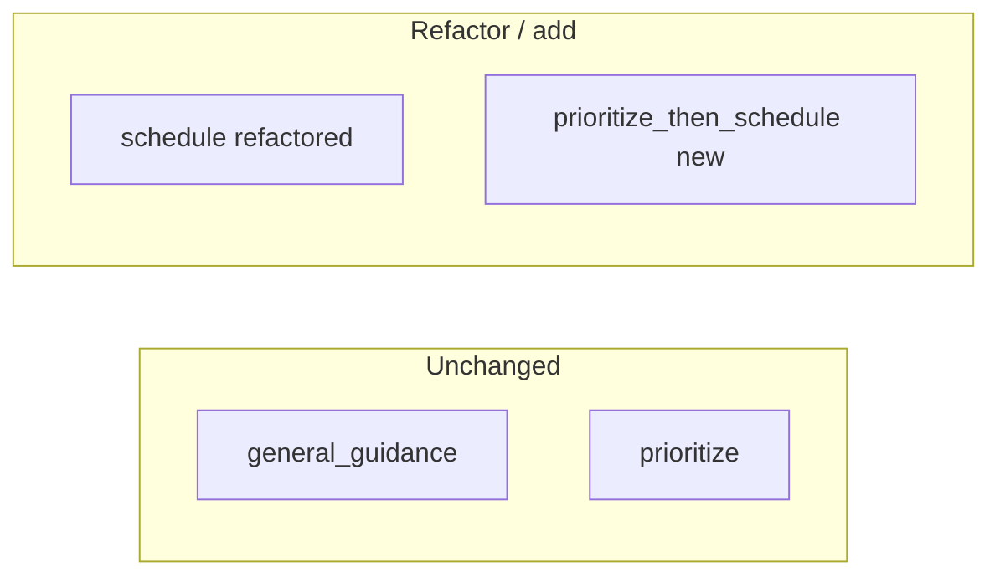

# Scheduling refactor (revised constraints)

## Non‑negotiables

- **Do not change** the existing **general guidance** flow: same entry points, prompts, validation, formatter behavior, and `runGeneralGuidanceFlow` logic.
- **Do not change** the existing **prioritization** flow: same `runPrioritizeFlow` path, prioritize-only schema validation/formatting, and user-visible behavior for prioritize messages.
- **Do** refactor **scheduling-only** generation so it is simpler and more robust by **reusing the same deterministic ranking engine** already used by prioritization (`TaskPrioritizationService`, constraints extraction, snapshot shape)—implemented **from scheduling code paths only** (e.g. [`TaskAssistantStructuredFlowGenerator`](app/Services/LLM/Scheduling/TaskAssistantStructuredFlowGenerator.php), [`runScheduleFlow`](app/Services/LLM/TaskAssistant/TaskAssistantService.php)) without editing prioritize orchestration.
- **Do** add a **new top-level flow** for **combined** prioritization + scheduling intent (new routing branch, new schema, new hybrid narrative, new processor/formatter branch). This **will** touch shared infrastructure files, but only by **adding** cases (enum value, `match` arms, new methods)—not by rewriting general_guidance or prioritize branches.

## What “touch pipelines” means (allowed)

| Area | Change |
|------|--------|
| Intent | New enum case (e.g. combined); extend LLM intent inference + merge rules in resolution **for the new case only** |
| Routing | Add routing/demotion/promotion rules so combined utterances hit the new flow; leave existing prioritize/schedule/general_guidance decisions as-is |
| Orchestration | New `runPrioritizeThenScheduleFlow` (or similar); refactor **only** `runScheduleFlow` + scheduling generator |
| Schema | New Prism/schema for combined flow; adjust schedule-only schema only if needed for the refactor |
| Hybrid narrative | New refinement method(s) for combined; optional small extension points if strictly required |
| Processor / formatter | New `flow` key (e.g. `prioritize_then_schedule`) |
| UI | New metadata section + Accept-all for combined; schedule-only UI updates if proposal model changes |

## Implementation outline (unchanged intent, compressed)

1. **Schedule-only**: Replace ad-hoc `buildSchedulingCandidates` ordering with a call chain that uses **`prioritizeFocus` + same filters/slice inputs** as prioritize derives from constraints (implemented inside scheduling module; **no** edits to `runPrioritizeFlow`).
2. **New combined flow**: When intent is “rank + place time”, run ranking once (same engine), placement once, then **one** hybrid LLM pass (or two bounded refinements) producing the **rich schema**: listing + prioritize reasoning block + proposals + schedule reasoning + confirmation line + chips.
3. **UX**: Primary **Accept all**; confirmation field; multiturn adjustment via conversation state (additive).
4. **Tests**: Full regression on general_guidance + prioritize suites; new tests for combined + refactored schedule-only.

## Open decisions (need your answers)

1. **Shared code vs zero edits to prioritize files**  
   To reuse ranking, the clean approach is scheduling code calling `TaskPrioritizationService` / extractors from **scheduling package**. If you require **zero line changes** in any file under prioritize flow paths, say so—otherwise we may extract a tiny shared helper **only if** we can prove behavioral parity with existing tests.

2. **Schedule-only vs combined for “pure” scheduling**  
   Should utterances that only ask for times (no explicit “what’s most important”) stay on **schedule-only** with the refactored pipeline, or always use the **combined** schema with a thin prioritize section?
