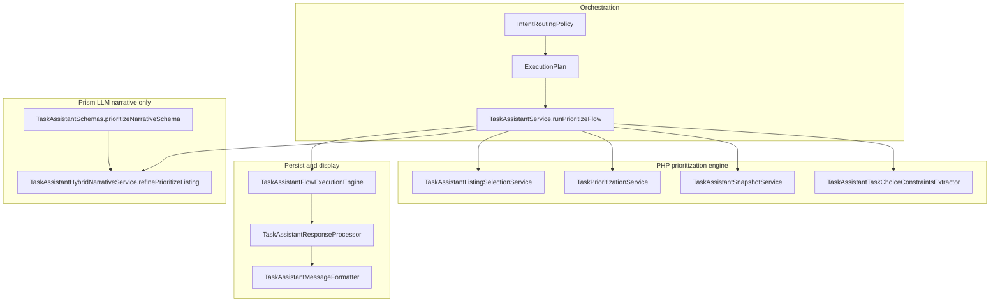

# Prioritization flow — architecture guide (Task Assistant)

This document describes how **dynamic prioritization** works in TaskLyst: configurable strategies and filters are resolved in **PHP**; **Prism** is used only for **student-facing narrative** on top of a list the backend has already fixed. It replaces an earlier draft that assumed a single LLM-owned “engine” JSON.

---

## 1. Goals

- **Dynamic:** Different user requests yield different filters, time scopes, listing-vs-focus behavior, and **N** (how many rows to show), driven by routing + extractors + services — not by a single static prompt.
- **Robust:** Ordered membership is **deterministic**; the model must not invent tasks or change order (same invariant as today).
- **Stack:** Laravel 12 orchestration, **Prism** `structured()` calls with `ObjectSchema` definitions in `App\Support\LLM\TaskAssistantSchemas`.

---

## 2. Layered architecture

| Layer | Responsibility |
|--------|----------------|
| **Orchestration** | Chooses `flow === 'prioritize'`, builds `ExecutionPlan` (limits, hints, targets, `generationProfile`). |
| **PHP engine** | Builds snapshot, applies constraints, ranks and selects rows (`items`), sets `limit_used`. |
| **Prism** | Fills **student-facing narrative UX only** (`acknowledgment`, `framing`, `insight`, `suggested_next_actions`, plus optional `reasoning` / `tradeoffs`) from a schema; instructions forbid reorder/replace rows. |
| **Persist / format** | Validates full payload, writes assistant `content` + `metadata.prioritize`, clamps lengths. |

---

## 3. Execution plan (dynamic “request context”)

Dynamic behavior is **not** a Prism “main schema” today. It is carried by **`App\Services\LLM\TaskAssistant\ExecutionPlan`** and related services:

| Field | Role |
|--------|------|
| `flow` | Must be `prioritize` for this pipeline. |
| `countLimit` | **Top N** cap (with listing/browse path using the same idea). |
| `constraints` | Populated from routing / clarification; merged with **`TaskAssistantTaskChoiceConstraintsExtractor`** output in `runPrioritizeFlow` (time scope, keywords, priority filters, domain hints, etc.). |
| `targetEntities` | Optional explicit entities (e.g. follow-up “those tasks”). |
| `timeWindowHint` | Scheduling-oriented hint; less central to prioritize than to schedule. |
| `generationProfile` | e.g. `prioritize` — reserved for future **narrative variant** selection (multiple Prism schemas or config). |
| `reasonCodes` | Audit / routing explainability (`llm_intent_prioritization`, etc.). |

**Future dynamism:** Add enum-like **strategy labels** (`top_n`, `week_slice`, `focus_caps`, …) either on `ExecutionPlan` or inside normalized `constraints`, resolved **before** ranking — still in PHP.

---

## 4. PHP engine: two prioritize subflows

Both subflows end with the **same persisted shape** (see §6) and the same Prism narrative step when there are items.

### 4.1 Focus / rank mode (default when not “list my tasks”)

1. Snapshot: `TaskAssistantSnapshotService::buildForUser` (bounded task limit, events, projects).
2. Constraints: `TaskAssistantTaskChoiceConstraintsExtractor::extract($userMessage)`.
3. Ranking: `TaskPrioritizationService::prioritizeFocus($snapshot, $context)` merges **tasks, events, and projects** into ordered candidates.
4. Slice: first `ExecutionPlan->countLimit` candidates → normalize into **`items`** rows (tasks get rich due/priority rows via `buildPrioritizeListingTaskRowFromRawTask`; events/projects get `entity_type`, `entity_id`, `title`).

### 4.2 Browse / listing mode

Triggered by `TaskAssistantService::shouldUsePrioritizeTaskListMode` (e.g. “show/list my tasks” without “prioritize/focus” phrasing).

1. Larger snapshot task limit from config (`task-assistant.listing.snapshot_task_limit`).
2. `TaskAssistantListingSelectionService::build` applies filters + deterministic ordering + `countLimit`.
3. Same narrative + persistence path.

**Invariant:** Order and membership are fixed **before** Prism runs.

---

## 5. Data the engine sees (snapshot DTO)

These shapes are what **`TaskAssistantSnapshotService`** builds (see class PHPDoc). They align with Eloquent **`Task`**, **`Event`**, **`Project`** — not a generic “impact/urgency/effort” task from an external template.

### 5.1 Task row (snapshot)

| Field | Source (concept) |
|--------|------------------|
| `id` | `tasks.id` |
| `title` | `tasks.title` (clamped length) |
| `subject_name`, `teacher_name` | `tasks` columns |
| `tags` | related tag names |
| `status` | `TaskStatus` value (`to_do`, `doing`, `done`) |
| `priority` | `TaskPriority` value |
| `complexity` | `TaskComplexity` value |
| `ends_at` | `tasks.end_datetime` ISO8601 |
| `project_id`, `event_id` | FKs |
| `duration_minutes` | `tasks.duration` |
| `is_recurring` | presence of `recurringTask` |

### 5.2 Event row (snapshot)

| Field | Source |
|--------|--------|
| `id` | `events.id` |
| `title` | `events.title` |
| `starts_at`, `ends_at` | datetimes |
| `all_day` | boolean |
| `status` | `EventStatus` value |

Events **do not** carry `priority` on the model; ranking logic in `TaskPrioritizationService` treats them by temporal relevance (see service implementation).

### 5.3 Project row (snapshot)

| Field | Source |
|--------|--------|
| `id`, `name` | `projects` |
| `start_at`, `end_at` | project window |

---

## 6. Prioritize listing row (`items[]`)

What gets validated under `prioritize` (see `TaskAssistantResponseProcessor::validatePrioritizeListingData`):

- Every row: `entity_type` ∈ `task`, `event`, `project`; `entity_id`, `title`.
- **Tasks** additionally (when present): `priority`, `due_bucket`, `due_phrase`, `due_on`, `complexity_label` (see `buildPrioritizeListingTaskRowFromRawTask`).
- No per-item LLM text is persisted on rows; `items` are strictly server-owned row identity + server-owned task labels.

This is the contract for **UI + narrative prompts** (`ITEMS_JSON`), not the raw snapshot.

---

## 7. Prism: narrative schema (LLM-owned UX fields)

**Class:** `App\Support\LLM\TaskAssistantSchemas::prioritizeNarrativeSchema`  
**Prism object name:** `prioritize_narrative`  
**Properties:**  
- `acknowledgment` (nullable string) — optional 1-sentence acknowledgment.
- `framing` (string) — required; short student-friendly framing.
- `insight` (nullable string) — optional non-obvious insight.
- `suggested_next_actions` (string[]) — required array of 1-4 short action strings.
- `reasoning` (nullable string) — optional short explanation (1-3 sentences).
- `tradeoffs` (nullable string[]) — optional 0-3 tradeoff strings.

**Call site:** `TaskAssistantHybridNarrativeService::refinePrioritizeListing`  
- Builds messages with `FILTER_CONTEXT` and ordered `ITEMS_JSON`.  
- Uses generation config: `config('task-assistant.generation.prioritize_narrative')` via route key **`prioritize_narrative`** in `attemptStructured`.  
- After Prism returns, the service derives `focus` deterministically from server-ordered `items` order (LLM does not output `focus`).

**Clamps / fallbacks:** `App\Support\LLM\TaskAssistantListingDefaults` — length clamps for framing/reasoning fields and deterministic fallback for `suggested_next_actions` when the LLM drops it.

### 7.1 Making narrative “more dynamic” (recommended patterns)

| Approach | Fits current architecture |
|----------|---------------------------|
| **A. Prompt-only** | Same schema; vary instructions from `constraints` / `ambiguous` / `filterContextForPrompt`. |
| **B. Multiple Prism schemas** | New methods e.g. `prioritizeNarrativeBrowseSchema()` vs `prioritizeNarrativeFocusSchema()`; select by `ExecutionPlan->generationProfile` or a new `narrativeMode` — mirrors `general_guidance` having several schemas. |
| **C. Optional JSON fields** | Extend `prioritizeNarrativeSchema` with nullable arrays/strings; **must** update validator + formatter + tests together. |

Do **not** move **ordering** into Prism output without a deliberate product change and new validation rules.

---

## 8. Persisted assistant payload (`metadata.prioritize`)

After `TaskAssistantFlowExecutionEngine::executeStructuredFlow` with `metadataKey: prioritize`, the structured payload includes at least:

- `items` — ordered listing rows (§6).  
- `limit_used` — integer.  
- `focus` (always present) — server-derived from `items` order:
  - `focus.main_task` = first item title
  - `focus.secondary_tasks` = titles of remaining items
- `framing` — required narrative (LLM + clamps / deterministic fallback).  
- `acknowledgment`, `insight`, `reasoning`, `tradeoffs` — optional narrative fields.  
- `suggested_next_actions` (always present) — array of short action strings.

`TaskAssistantConversationStateService::rememberLastListing` stores the listing for follow-ups (e.g. schedule “those”).

---

## 9. Validation and formatter

- **Validation:** `TaskAssistantResponseProcessor::validatePrioritizeListingData` — Laravel `Validator` rules; must stay in sync with any new keys.  
- **User-visible body:** `TaskAssistantMessageFormatter::formatPrioritizeListingMessage` — renders in this order: optional `acknowledgment`, required `framing`, formatted `items`, optional `insight` / `reasoning` / `tradeoffs`, then `suggested_next_actions` in a final “Next actions” section.

---

## 10. Configuration touchpoints

| Config path | Purpose |
|-------------|---------|
| `task-assistant.generation.prioritize` | Optional override for non-narrative generation routes (if used). |
| `task-assistant.generation.prioritize_narrative` | Temperature / max_tokens / top_p for Prism narrative. |
| `task-assistant.listing.*` | Browse limits, max reasoning/guidance chars. |
| `task-assistant.intent.*` | Routing thresholds (see `IntentRoutingPolicy`). |

---

## 11. Testing expectations

When extending dynamism, update or add:

- `tests/Unit/TaskAssistantResponseProcessorTest.php` (rules).  
- `tests/Unit/TaskAssistantMessageFormatterTest.php` (layout).  
- `tests/Feature/TaskAssistantPrioritizeListingFlowTest.php` / `TaskAssistantServiceTest.php` (end-to-end metadata).  
- `tests/Unit/TaskPrioritizationServiceTest.php` (ranking invariants).

---

## 12. Design principles (aligned with codebase)

1. **Final order = PHP.** Prism explains; it does not reorder `items`.  
2. **Snapshot and listing rows match real models** (Task / Event / Project), plus derived fields only where already implemented (due buckets, labels).  
3. **One persisted prioritize shape** unless you version metadata (`prioritize_v2`) and migrate UI.  
4. **Multiple Prism schemas are allowed** when behavior genuinely differs — contradicts a naive “one schema only” rule; prefer clarity over dogma.  
5. **Strategy and scoring stay testable** in PHP (`TaskPrioritizationService`), not hidden inside non-deterministic JSON from the model.

---

## 13. Mapping from the old “engine” concept

| Old doc concept | TaskLyst implementation |
|-----------------|-------------------------|
| `request_context.strategy` | `ExecutionPlan` + `constraints` + subflow (focus vs listing). |
| `limit` | `ExecutionPlan->countLimit` (+ listing caps). |
| `timeframe` | Extractor context keys; `TaskPrioritizationService::filterTasksForTimeConstraint` where used. |
| Generic task with impact/urgency/effort | **Not in DB**; use `priority`, `complexity`, datetimes, tags — or add derived scores in PHP only. |
| LLM `output.results.prioritized_order` | **Do not use** for truth; use `items` from engine. |
| Per-task LLM `why_selected` | Future: optional narrative extension or PHP-generated bullets — not current schema. |

This guide should be updated when `ExecutionPlan`, snapshot DTOs, Prism schemas, or validator rules change.
